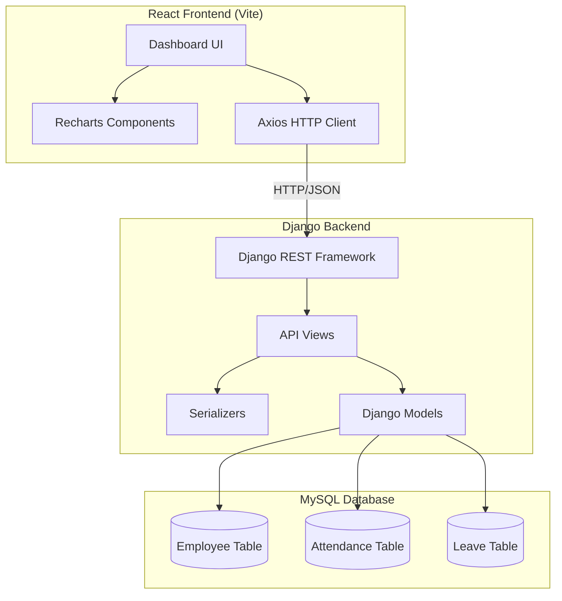
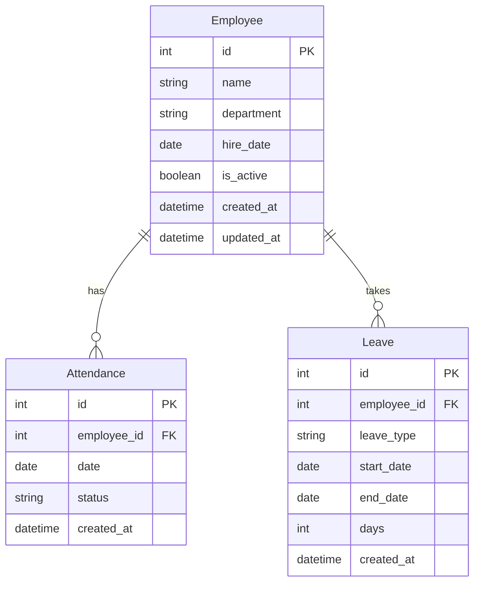

# Design Document: HR Analytics Dashboard

## Overview

The HR Analytics Dashboard is a full-stack web application that provides HR teams with real-time analytics on employee attendance, leave usage, and attrition rates. The system consists of a Django REST Framework backend connected to MySQL for data storage and aggregation, and a React frontend with Tailwind CSS for visualization using Recharts.

The architecture follows a client-server model where the React SPA communicates with the Django API via HTTP/JSON. The backend handles all data aggregation and business logic, while the frontend focuses on rendering interactive charts and KPI cards.

## Architecture



### Technology Stack

| Layer | Technology | Purpose |
|-------|------------|---------|
| Frontend | React (Vite) | SPA framework |
| Styling | Tailwind CSS | Utility-first CSS |
| Charts | Recharts | Data visualization |
| HTTP Client | Axios | API communication |
| Backend | Django 4.x | Web framework |
| API | Django REST Framework | REST API |
| Database | MySQL | Data persistence |
| DB Connector | mysqlclient | MySQL driver |

## Components and Interfaces

### Backend Components

#### 1. Django Models

```python
# models.py
class Employee:
    id: int (PK, auto)
    name: str (max_length=100)
    department: str (max_length=50)
    hire_date: date
    is_active: bool (default=True)
    created_at: datetime (auto)
    updated_at: datetime (auto)

class Attendance:
    id: int (PK, auto)
    employee: FK(Employee)
    date: date
    status: str (choices: 'present', 'absent', 'late')
    created_at: datetime (auto)

class Leave:
    id: int (PK, auto)
    employee: FK(Employee)
    leave_type: str (choices: 'sick', 'vacation', 'personal')
    start_date: date
    end_date: date
    days: int
    created_at: datetime (auto)
```

#### 2. API Endpoints

| Endpoint | Method | Description | Response |
|----------|--------|-------------|----------|
| `/api/employees/` | GET | List all employees | Employee[] |
| `/api/attendance/analytics/` | GET | Attendance aggregations | {absenteeism_rate, trend_data[]} |
| `/api/leave/analytics/` | GET | Leave type breakdown | {leave_by_type: {sick, vacation, personal}} |
| `/api/attrition/analytics/` | GET | Attrition metrics | {attrition_rate, monthly_data[]} |

#### 3. Serializers

```python
# serializers.py
class EmployeeSerializer:
    - Serializes Employee model to JSON
    - Includes nested attendance/leave counts

class AttendanceAnalyticsSerializer:
    - Serializes aggregated attendance data
    - Fields: absenteeism_rate, department_breakdown, trend_data

class LeaveAnalyticsSerializer:
    - Serializes leave breakdown by type
    - Fields: sick_count, vacation_count, personal_count, total_days

class AttritionAnalyticsSerializer:
    - Serializes attrition metrics
    - Fields: attrition_rate, employees_left, total_employees, monthly_trend
```

### Frontend Components

#### 1. React Component Structure

```
src/
├── components/
│   ├── Dashboard.jsx          # Main dashboard container
│   ├── KPICard.jsx            # Reusable KPI display card
│   ├── AttendanceChart.jsx    # Line chart for attendance trends
│   ├── LeaveChart.jsx         # Bar chart for leave breakdown
│   ├── AttritionChart.jsx     # Chart for attrition metrics
│   └── Navbar.jsx             # Navigation component
├── services/
│   └── api.js                 # Axios API client configuration
├── hooks/
│   └── useAnalytics.js        # Custom hook for data fetching
└── App.jsx                    # Root component with routing
```

#### 2. API Service Interface

```javascript
// services/api.js
const api = {
    getAttendanceAnalytics(): Promise<AttendanceData>
    getLeaveAnalytics(): Promise<LeaveData>
    getAttritionAnalytics(): Promise<AttritionData>
    getEmployees(): Promise<Employee[]>
}
```

## Data Models

### Database Schema



### API Response Schemas

```typescript
// Attendance Analytics Response
interface AttendanceAnalytics {
    absenteeism_rate: number;      // Percentage (0-100)
    total_working_days: number;
    total_absent_days: number;
    trend_data: {
        date: string;
        present_count: number;
        absent_count: number;
    }[];
    department_breakdown: {
        department: string;
        absenteeism_rate: number;
    }[];
}

// Leave Analytics Response
interface LeaveAnalytics {
    leave_by_type: {
        sick: number;
        vacation: number;
        personal: number;
    };
    total_leave_days: number;
    monthly_trend: {
        month: string;
        days: number;
    }[];
}

// Attrition Analytics Response
interface AttritionAnalytics {
    attrition_rate: number;        // Percentage (0-100)
    employees_left: number;
    total_employees: number;
    monthly_trend: {
        month: string;
        left_count: number;
        attrition_rate: number;
    }[];
}
```


## Correctness Properties

*A property is a characteristic or behavior that should hold true across all valid executions of a system-essentially, a formal statement about what the system should do. Properties serve as the bridge between human-readable specifications and machine-verifiable correctness guarantees.*

### Property 1: Employee Data Persistence Round-Trip

*For any* valid employee data (name, department, hire_date, is_active), creating an employee record and then retrieving it should return the same data that was submitted.

**Validates: Requirements 1.1**

### Property 2: Absenteeism Rate Calculation Correctness

*For any* set of attendance records with known present/absent counts, the calculated absenteeism rate should equal (absent_days / total_working_days) × 100, with floating-point precision tolerance.

**Validates: Requirements 2.2**

### Property 3: Attendance Department Grouping Integrity

*For any* set of attendance records across multiple departments, the aggregated data returned by the API should contain exactly one entry per department, and the sum of all department records should equal the total attendance records.

**Validates: Requirements 2.4**

### Property 4: Leave Aggregation by Type Correctness

*For any* set of leave records with various leave types, the API response should return leave counts where the sum of (sick + vacation + personal) equals the total leave days in the dataset.

**Validates: Requirements 3.2, 3.3**

### Property 5: Attrition Rate Calculation Correctness

*For any* set of employee records with known active/inactive status, the calculated attrition rate should equal (inactive_employees / total_employees) × 100, with floating-point precision tolerance.

**Validates: Requirements 4.2**

### Property 6: API JSON Response Format Validity

*For any* valid API request to any endpoint, the response should be valid JSON with an appropriate HTTP status code (200 for success, 4xx for client errors, 5xx for server errors).

**Validates: Requirements 5.2**

### Property 7: Serialization Round-Trip Consistency

*For any* valid model instance (Employee, Attendance, or Leave), serializing to JSON and then deserializing back should produce an equivalent object with all fields preserved.

**Validates: Requirements 5.4, 5.5**

### Property 8: CSV Export Round-Trip (Stretch Goal)

*For any* analytics data displayed on the dashboard, exporting to CSV and parsing the CSV should produce data equivalent to the original dataset.

**Validates: Requirements 8.1**

## Error Handling

### Backend Error Handling

| Error Type | HTTP Status | Response Format |
|------------|-------------|-----------------|
| Validation Error | 400 | `{"error": "message", "field": "field_name"}` |
| Not Found | 404 | `{"error": "Resource not found"}` |
| Database Error | 500 | `{"error": "Internal server error"}` |
| CORS Error | 403 | Handled by django-cors-headers |

### Frontend Error Handling

```javascript
// Error handling strategy
try {
    const data = await api.getAttendanceAnalytics();
    setData(data);
} catch (error) {
    if (error.response?.status === 404) {
        setError("No data available");
    } else if (error.response?.status >= 500) {
        setError("Server error. Please try again later.");
    } else {
        setError("Failed to load data");
    }
}
```

### Error States in UI

- Loading state: Show spinner while fetching data
- Empty state: Show message when no data exists
- Error state: Show error message with retry button
- Timeout: Show timeout message if request exceeds 10 seconds

## Testing Strategy

### Property-Based Testing

The project will use **Hypothesis** for Python (backend) and **fast-check** for JavaScript (frontend) for property-based testing.

**Backend (Python/Django):**
- Library: `hypothesis` with `hypothesis[django]` plugin
- Minimum iterations: 100 per property test
- Test file location: `backend/hr_analytics/tests/test_properties.py`

**Frontend (JavaScript/React):**
- Library: `fast-check`
- Minimum iterations: 100 per property test
- Test file location: `frontend/src/__tests__/properties.test.js`

Each property-based test MUST:
1. Be tagged with a comment referencing the correctness property: `**Feature: hr-analytics-dashboard, Property {number}: {property_text}**`
2. Run a minimum of 100 iterations
3. Use smart generators that constrain inputs to valid domain values

### Unit Testing

**Backend:**
- Framework: `pytest` with `pytest-django`
- Coverage target: Core business logic (calculations, aggregations)
- Test locations: `backend/hr_analytics/tests/`

**Frontend:**
- Framework: `Vitest` (comes with Vite)
- Coverage target: API service functions, utility functions
- Test locations: `frontend/src/__tests__/`

### Integration Testing

- Test API endpoints with realistic data scenarios
- Test React components with mocked API responses
- Test database queries with test fixtures

### Manual Testing

- Use Postman for API endpoint verification
- Use Chrome DevTools for frontend performance monitoring
- Target: Dashboard load time < 2 seconds, API response < 500ms
